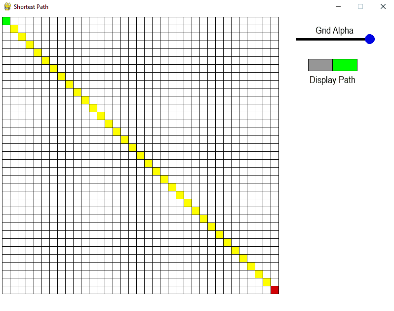
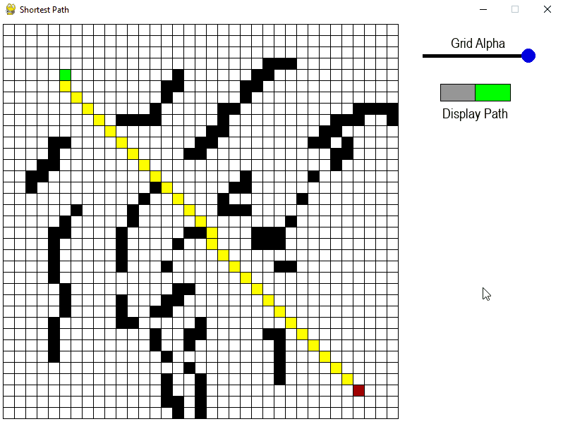

# Shortest Path
An interactive application to visualize a path-finding algorithm that finds the shortest route between two points given obstacles in the way.

## Technologies
Python 3.10

PyGame 2.5.2

## Features
This application allows a user to draw an obstacle course between two adjustable points in a grid. The grid can be fully turned off via a slider on the right. The path is updated live so the user can see immediate feedback about the walls (invalid cells) they have placed. There are four ways to interact with the grid:
* Left-Click: Adds walls to the grid. Users can hold down left-click to draw multiple walls in succession.
* Right-click: Removes walls to the grid. Users can hold down right-click to remove multiple walls in succession.
* Shift + Left-Click: Moves starting location (green cell).
* Shift + Right-Click: Moves ending location (red cell).

The user has the option to remove the automatic drawing of the line. This allows for reduced lag when drawing on grids with much larger cells. Inside the settings file the user can adjust various options such as the number of cells in the grid (adjust TILESIZE, TILEWIDTH, and TILEHEIGHT).

## Approach
This project was created in a couple of phases. The initial phase was a proof of concept of a working algorithm and I programmed it to just output the optimal path of a 5x5 grid in the console. Other than some tweaks and optimizations to the algorithm, once it was functioning, the main logic of the application was left largely untouched. This was done for a deliberate reason, as one of the challenges I had for myself was to try to keep different parts of the program isolated. It's very easy to have logic features implemented via limitations in the GUI (for example, in a game of hangman, not allowing a letter to be chosen because the user can't click on it, even if the backend would allow it). I wanted the GUI to be a shell that I could put on top of an already functioning console application.

I chose PyGame as the GUI for this project as I have some level of familiarity with it from other projects. Other libraries/frameworks considered were Matplotlib, tkinter, and PySimpleGui. None of these seemed to offer anything I couldn't already do in PyGame, however, and more often were more limited in their functionality and features.

Additionally, to continue keeping the separation of code the best I could, I tried building modules for the first time. The slider and the switch were both made with the intention of having no program-specific logic in them. It should allow them to be imported into another PyGame application and be fully functional.

Finally, the algorithm chosen was Dijkstra's Algorithm. It seemed the most intuitive as I could treat each orthogonal cell as having an edge of weight 1, and each diagonal cell as having an edge of weight 1.4142, and then map out all the cells in the grid relative to the starting node.

## Challenges
Several aspects of this project have proved to be challenging, but most were resolved. One issue that plagued the application for a while was a rounding error that was handled unnecessarily in very large grids. This led to weird situations where the grid could go from a suitable path to a wildly unsuitable one with a single wall placement.

Another solved challenge was getting the transparency of the grid to function correctly. PyGame has an issue where you can not make lines transparent if it is on the base surface, so it requires adding an additional surface that can handle them. Additionally, the grid lines even when fully transparent would still prevent other colors on the same surface from existing in that same space. It took a lot of fiddling around with different layers to get the colors to function as intended.

Finally, the last challenge I'm working on is improving the algorithm to handle larger grids. At the moment when going above 1500ish cells, the algorithm slows enough to be noticeable while drawing walls or moving the starting point. This only got more extreme as the grid grew. I'm considering rebuilding the Dijkstra's algorithm from the ground up with efficiency as the goal. Alternatively, I know the A* algorithm is likely more efficient for this project and I may switch to that. For the time being, removing the yellow pathfinding line disables the rapid recalculations and reduces lag.

## Images and GIFs

Example of live pathfinding while adding walls and moving endpoints.

Demonstration of features to alter the state of the application (grid transparency, removal of path visual).

